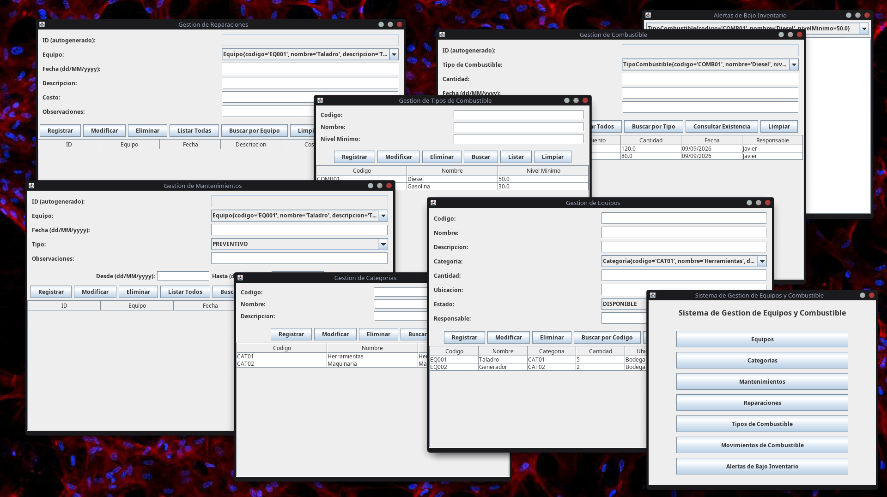

# Sistema de Gestión de Equipos y Combustible para Serteces

> Aplicación desarrollada en Java para la gestión de equipos,
> inventario y combustible de la compañía Serteces, proyecto para la clase de Programación Orientada a Objetos en la UNIS.

## Miembros del Grupo
-Javier Guzman
-Agustín Illescas
-Esteban Mesa

## Descripción

Este proyecto, desarrollado por el Grupo 3, consiste en una aplicación
para llevar el control y la gestión del inventario de la compañía
Serteces.

El sistema permite administrar equipos, mantenimientos, reparaciones,
combustibles y movimientos de combustible, además de proporcionar
herramientas para el control del inventario.

## Funcionalidades

- Gestión de equipos
- Registro de mantenimientos
- Registro de reparaciones
- Gestión de tipos de combustible
- Registro de movimientos de combustible
- Creación y gestión de categorías
- Identificación de productos mediante un ID único
- Alertas de bajo inventario

## Gestión de inventario

El sistema permite registrar información detallada de los productos,
incluyendo:

- **Código**
- **Nombre**
- **Descripción**
- **Categoría**
- **Cantidad**
- **Ubicación física**
- **Estado**
- **Persona responsable**

## Imagen de la aplicación
![Aplicación con todas sus ventanas abiertas] (Ventanas.png)

